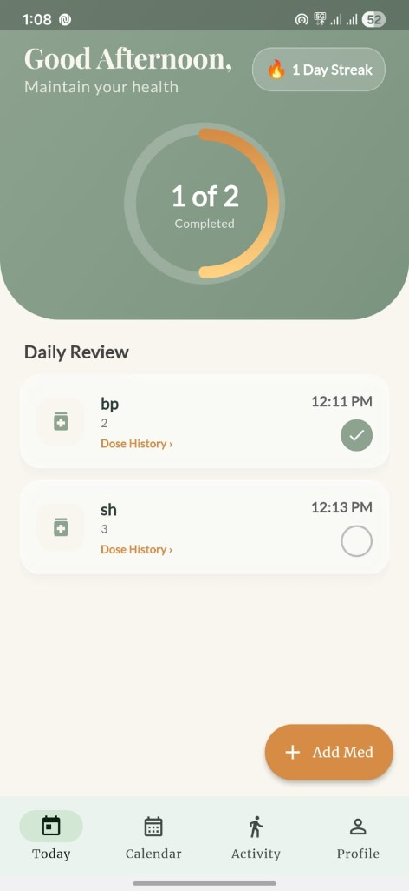
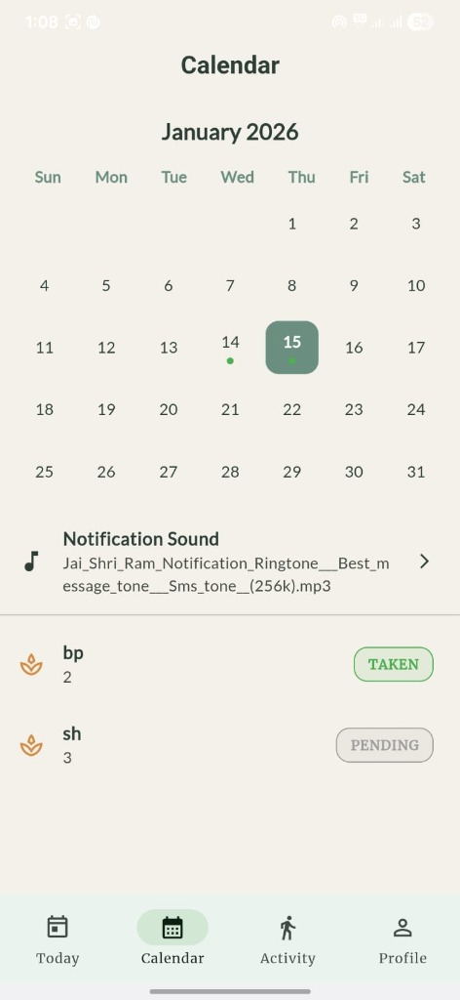
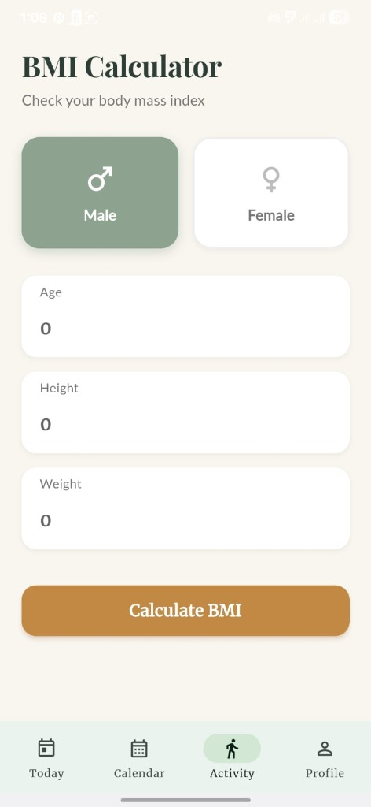
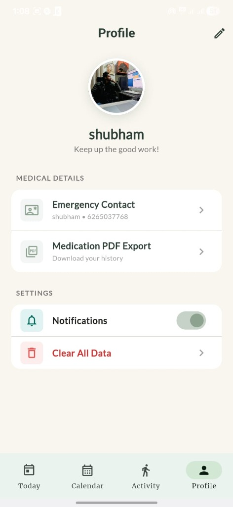

# Medicine Reminder & BMI Calculator

A Flutter-based application designed to help users manage their medication schedule and monitor their Body Mass Index (BMI).

## Features

- **Medicine Reminder**: Set up schedules for your medications to never miss a dose.
- **BMI Calculator**: Calculate your Body Mass Index easily to keep track of your health.

## Tech Stack

- **Framework**: Flutter
- **Language**: Dart

## Screenshots


<div style="display: flex; flex-direction: row; overflow-x: auto; gap: 10px;">
  
  
  
  
</div>


## How to Run Locally

To get this project running on your local machine:

1.  **Clone the repository** (if you haven't already).
2.  **Install dependencies**:
    ```bash
    flutter pub get
    ```
3.  **Run the app**:
    ```bash
    flutter run
    ```

## Disclaimer

**BMI results are for general health reference only.** Please consult a healthcare professional for medical advice.

## Note

**This project is for learning / portfolio purposes.**
